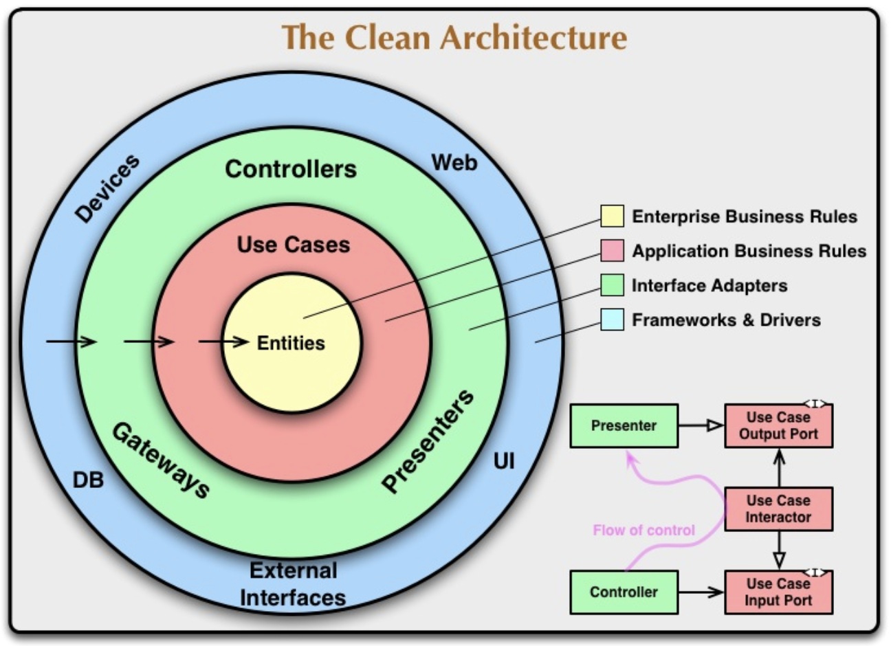
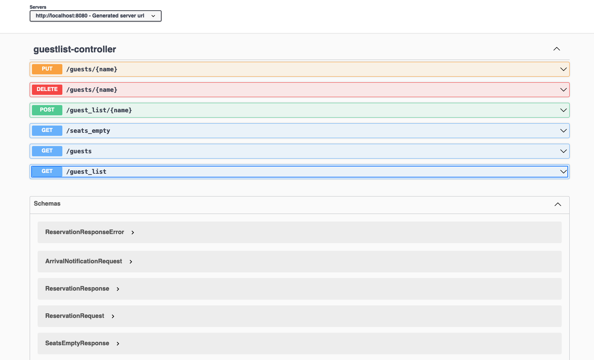

# Party Guest List

This application implements an RESTful API to manage the guest list of a private party. The number of tables and seat capacity are subject to change.  
  
When the party begins, guests will arrive with their accompanying guests. This number may not be the size indicated on the guest list. However, if it is expected that the guest's table can accommodate the extra people, then the they all should be let in. Otherwise, they will be turned away.  
Guests will also leave throughout the course of the party. Note that when a guest leaves, their accompanying guests will leave with them.

*At any point in the party, the application must be able to show*:
- *The guests at the party*
- *How many empty seats there are*

## API

### Add a guest to the guestlist

If there is insufficient space at the specified table, then an error should be thrown.

```
POST /guest_list/name
body: 
{
    "table": int,
    "accompanying_guests": int
}
response: 
{
    "name": "string"
}
```

### Get the guest list

```
GET /guest_list
response: 
{
    "guests": [
        {
            "name": "string",
            "table": int,
            "accompanying_guests": int
        }, ...
    ]
}
```

### Guest Arrives

A guest may arrive with an entourage that is not the size indicated at the guest list.
If the table is expected to have space for the extras, allow them to come. Otherwise, this method should throw an error.

```
PUT /guests/name
body:
{
    "accompanying_guests": int
}
response:
{
    "name": "string"
}
```

### Guest Leaves

When a guest leaves, all their accompanying guests leave as well.

```
DELETE /guests/name
```

### Get arrived guests

```
GET /guests
response: 
{
    "guests": [
        {
            "name": "string",
            "accompanying_guests": int,
            "time_arrived": "string"
        }
    ]
}
```

### Count number of empty seats

```
GET /seats_empty
response:
{
    "seats_empty": int
}
```

## Architecture
The application is structured as per the Clean (or Hexagonal) Architecture, with the services in the `usecase` package and the `controller` and `persistence` layers living in their own packages under the `adapter` package. I haven't yet created any *domain objects* but, in the future, they should live in the `domain` package and have no reference to other objects. Only use cases will be allowed to reference them as dependencies must only point inwards (**the dependency rule**).  
  
  
  
## Development

I used TDD to guide my development (red, green, refactor); the `GuestlistServiceTests.java` class contains all unit tests. I have mocked up all database accesses to allow them to run fast. They are unit tests after all!  
  
## Acceptance tests
  
If we are practising Continuous Delivery, we must have all our tests automated. I followed the BDD style without using any external framework for the sake of simplicity. All test cases have been defined following the expected behaviour specified in the instructions.
All acceptance tests are in the `MainApplicationTests.java` class. I covered all behaviours described in the instructions and add some extras to handle edge cases.  
  
## Architectural decisions 
  
1. I have adopted the Clean Architecture pattern to allow the application to grow without sacrificing maintainability. Different concerns are kept separate in different layers.
1. The main service, `GuestlistService.java`, is completely testable due to the use of DI.
1. The outer layers, `controller` and `persistence`, can be swapped out without affecting the inner layer: `usecases`.
1. To exemplify the previous point, leveraging the Spring Boot capabilities, I have built the persistence layer to support two different databases: MySQL and (in-memory) H2.
1. Security was not implemented for simplicity's sake although it would be required in a real-life application due to insecure HTTP methods.

## Comments on the API

I consider the API proposed a good starting point but there are some room for improvements.  

1. I would recommend including the service name as the first level at the API path, for example `/guestlist/...`, so that consumers could easily identify the API without counting on DNS names. (I have added it)
1. The *Add Guest* could return a `201` status code and the location of the newly-created entity.
1. Should the previous point be adopted, the `GET /guest_list/name` were to be required.
1. All operations should define the expected HTTP status code. I tried to follow the best practices with the exception of the *Add Guest* endpoint mentioned above. 
1. The *Add Guest* operation could perform the following additional checks (I have added them):
    1. @param `guestName` - guests cannot have more than one reservation
    1. @param `tableNumber` - the table must exist and be available
1. The *Guest Arrives* operation could perform the following additional checks (I have added them):
    1. @param `guestName` - the guest must have a valid reservation
    1. @param `guestName` - the guest must have not yet arrived
1. The *Guest Leaves* operation could perform the following additional checks (I have added them):
    1. @param `guestName` - the guest must have a valid reservation
    1. @param `guestName` - the guest must be in the venue

## API documentation (OpenAPI)

I have included the `springdoc-openapi-ui` dependency in the project which automatically renders a HTML page containing the OpenAPI v3 documentation for all endpoints exposed via *Spring Boot Controllers*. As per my experience, automatically generated documentation is the only viable way to keep it up to date.  
  
With the application running, point your browser at `http://localhost:8080/swagger-ui.html`
  
  
  
  
## How to test and run the application

- To run the unit tests locally, go to the `.\app` folder and enter: 
`mvn test`

- To run the application locally using the embedded in-memory database, go to the `.\app` folder and issue:  
  ```
  mvn package
  java -jar target/guestlist-1.0-SNAPSHOT.jar
  ```
    
  The application will be available at the port **8080**.  
  You can try, for example:  
  `curl localhost:8080/guest_list`

- To build and run both the application and MySQL containers, go back to the *project root* folder and enter:  
`make docker-up`  
 
  *N.B. You need to have Docker installed on your machine*  
  The makefile will start a Maven container to build the application container using **multi-stage building** so that the final app container does not contain building tools. It will then spin up two containers: *app* and *database*. The application is going to connect to the MySQL database this time.  
  To verify the containers running, enter `docker ps`
    
  The application will be available at the port **8080** again.  
  
  The MySQL database running in its container can be accessed through the user *user* with password *password*. For example, if you have MySQL client installed on your machine, use:  
  `mysql -u user -ppassword -h 127.0.0.1 database`
  
- To shut down both containers, go to the *project root* folder and enter:  
`make docker-down`  


